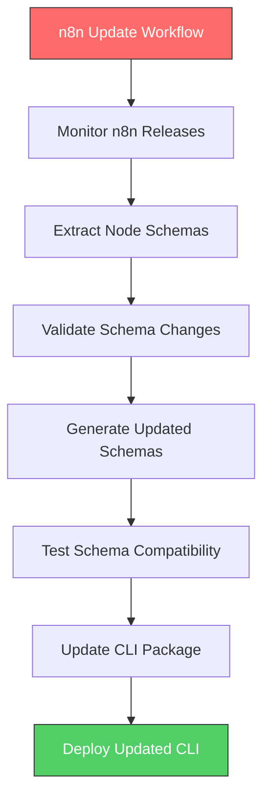

# 🚀 N8n Node Expansion Plan

**Date:** 2025-09-07  
**Mode:** VAN (Initialization)  
**Objective:** Comprehensive coverage of all official n8n nodes

---

## 🎯 Current Status

### Currently Supported Nodes (5/100+)

- ✅ `n8n-nodes-base.function` - JavaScript execution
- ✅ `n8n-nodes-base.httpRequest` - HTTP API calls
- ✅ `n8n-nodes-base.set` - Data manipulation
- ✅ `n8n-nodes-base.if` - Conditional logic
- ✅ `n8n-nodes-base.switch` - Multi-condition logic

### Coverage Gap Analysis

- **Current Coverage:** ~5% of official n8n nodes
- **Estimated Total Nodes:** 100+ official nodes across multiple categories
- **Priority:** High - Core functionality nodes first, then specialized nodes

---

## 📋 Comprehensive Node Categories

### 1. **Core Logic Nodes** (Priority: HIGH)

- ✅ `n8n-nodes-base.if` - Conditional logic
- ✅ `n8n-nodes-base.switch` - Multi-condition logic
- [ ] `n8n-nodes-base.merge` - Data merging
- [ ] `n8n-nodes-base.splitInBatches` - Batch processing
- [ ] `n8n-nodes-base.wait` - Wait/delay operations
- [ ] `n8n-nodes-base.stopAndError` - Error handling
- [ ] `n8n-nodes-base.respondToWebhook` - Webhook responses

### 2. **Data Manipulation Nodes** (Priority: HIGH)

- ✅ `n8n-nodes-base.set` - Data setting
- [ ] `n8n-nodes-base.itemLists` - List operations
- [ ] `n8n-nodes-base.sort` - Data sorting
- [ ] `n8n-nodes-base.limit` - Data limiting
- [ ] `n8n-nodes-base.aggregate` - Data aggregation
- [ ] `n8n-nodes-base.removeDuplicates` - Deduplication

### 3. **HTTP & Web Nodes** (Priority: HIGH)

- ✅ `n8n-nodes-base.httpRequest` - HTTP requests
- [ ] `n8n-nodes-base.webhook` - Webhook triggers
- [ ] `n8n-nodes-base.httpRequestAuth` - HTTP authentication
- [ ] `n8n-nodes-base.request` - Request handling

### 4. **Code & Function Nodes** (Priority: HIGH)

- ✅ `n8n-nodes-base.function` - JavaScript execution
- [ ] `n8n-nodes-base.code` - Code execution
- [ ] `n8n-nodes-base.functionItem` - Item-level functions

### 5. **Database Nodes** (Priority: MEDIUM)

- [ ] `n8n-nodes-base.postgres` - PostgreSQL
- [ ] `n8n-nodes-base.mysql` - MySQL
- [ ] `n8n-nodes-base.mongodb` - MongoDB
- [ ] `n8n-nodes-base.redis` - Redis
- [ ] `n8n-nodes-base.sqlite` - SQLite

### 6. **Cloud Storage Nodes** (Priority: MEDIUM)

- [ ] `n8n-nodes-base.awsS3` - Amazon S3
- [ ] `n8n-nodes-base.googleDrive` - Google Drive
- [ ] `n8n-nodes-base.dropbox` - Dropbox
- [ ] `n8n-nodes-base.oneDrive` - Microsoft OneDrive

### 7. **Communication Nodes** (Priority: MEDIUM)

- [ ] `n8n-nodes-base.emailSend` - Email sending
- [ ] `n8n-nodes-base.slack` - Slack integration
- [ ] `n8n-nodes-base.discord` - Discord integration
- [ ] `n8n-nodes-base.telegram` - Telegram integration

### 8. **File Processing Nodes** (Priority: MEDIUM)

- [ ] `n8n-nodes-base.readFile` - File reading
- [ ] `n8n-nodes-base.writeFile` - File writing
- [ ] `n8n-nodes-base.spreadsheetFile` - Spreadsheet processing
- [ ] `n8n-nodes-base.xml` - XML processing
- [ ] `n8n-nodes-base.csv` - CSV processing

### 9. **Authentication & Security Nodes** (Priority: MEDIUM)

- [ ] `n8n-nodes-base.oauth2Api` - OAuth2 authentication
- [ ] `n8n-nodes-base.aws` - AWS authentication
- [ ] `n8n-nodes-base.googleApi` - Google API authentication

### 10. **Specialized Service Nodes** (Priority: LOW)

- [ ] `n8n-nodes-base.cron` - Scheduled triggers
- [ ] `n8n-nodes-base.manualTrigger` - Manual triggers
- [ ] `n8n-nodes-base.scheduleTrigger` - Schedule triggers
- [ ] `n8n-nodes-base.interval` - Interval triggers

---

## 🚀 Implementation Strategy

### Phase 1: Core Logic & Data Nodes (Weeks 1-2)

**Target:** 15 additional nodes

- Focus on high-priority core functionality
- Essential for basic workflow validation
- Foundation for more complex workflows

### Phase 2: HTTP & Communication Nodes (Weeks 3-4)

**Target:** 20 additional nodes

- Web integration capabilities
- API communication patterns
- Common integration scenarios

### Phase 3: Database & Storage Nodes (Weeks 5-6)

**Target:** 25 additional nodes

- Data persistence patterns
- Cloud storage integration
- Database operations

### Phase 4: Specialized & Advanced Nodes (Weeks 7-8)

**Target:** 30+ additional nodes

- Advanced functionality
- Specialized integrations
- Edge cases and complex scenarios

---

## 🔄 Update Strategy: N8n Workflow-Based Updates

### Future Enhancement: Automated Schema Updates

#### Concept: Self-Updating CLI via N8n Workflow

The update strategy will be implemented as a **future enhancement** using n8n itself to manage schema updates:

#### Workflow Components:

1. **Schema Monitor Node** - Watches n8n repository for changes
2. **Schema Extractor Node** - Extracts node definitions from n8n source
3. **Schema Validator Node** - Validates extracted schemas
4. **Schema Generator Node** - Generates JSON Schema definitions
5. **Compatibility Tester Node** - Tests schema compatibility
6. **Package Updater Node** - Updates CLI package with new schemas
7. **Deployment Node** - Deploys updated CLI to PyPI

#### Benefits:

- **Automated Updates** - No manual schema maintenance
- **Version Synchronization** - Always in sync with n8n releases
- **Quality Assurance** - Automated testing of schema changes
- **Self-Documenting** - Update process documented as n8n workflow

---

## 📊 Implementation Plan

### Immediate Actions (Next 2 Weeks)

#### Week 1: Core Logic Expansion

- [ ] **Day 1-2:** Implement `merge`, `splitInBatches`, `wait` nodes
- [ ] **Day 3-4:** Implement `stopAndError`, `respondToWebhook` nodes
- [ ] **Day 5:** Testing and validation of new nodes

#### Week 2: Data Manipulation Expansion

- [ ] **Day 1-2:** Implement `itemLists`, `sort`, `limit` nodes
- [ ] **Day 3-4:** Implement `aggregate`, `removeDuplicates` nodes
- [ ] **Day 5:** Testing and validation of new nodes

### Medium-term Goals (Next 4 Weeks)

#### Weeks 3-4: HTTP & Communication

- [ ] Implement all HTTP-related nodes
- [ ] Add communication platform integrations
- [ ] Test webhook and API scenarios

#### Weeks 5-6: Database & Storage

- [ ] Implement database connection nodes
- [ ] Add cloud storage integrations
- [ ] Test data persistence scenarios

### Long-term Vision (Next 8 Weeks)

#### Weeks 7-8: Complete Coverage

- [ ] Implement remaining specialized nodes
- [ ] Achieve 90%+ coverage of official n8n nodes
- [ ] Develop automated update workflow (future enhancement)

---

## 🎯 Success Metrics

### Coverage Targets

- **Week 2:** 20 nodes (20% coverage)
- **Week 4:** 40 nodes (40% coverage)
- **Week 6:** 65 nodes (65% coverage)
- **Week 8:** 90+ nodes (90%+ coverage)

### Quality Metrics

- **Test Coverage:** Maintain 88%+ test coverage
- **Schema Accuracy:** 100% schema validation accuracy
- **Performance:** <2s validation time for complex workflows
- **Compatibility:** 100% backward compatibility

### User Experience

- **Error Clarity:** Clear, actionable error messages
- **Documentation:** Complete node documentation
- **Examples:** Sample workflows for each node type
- **Community:** Active community contributions

---

## 🔧 Technical Implementation

### Schema Generation Strategy

1. **Manual Schema Creation** - Initial implementation
2. **Template-Based Generation** - Automated schema creation
3. **N8n Workflow Extraction** - Future automated extraction
4. **Community Contributions** - Community-driven schema additions

### Testing Strategy

1. **Unit Tests** - Individual node schema validation
2. **Integration Tests** - End-to-end workflow validation
3. **Performance Tests** - Large workflow validation
4. **Compatibility Tests** - Backward compatibility validation

### Documentation Strategy

1. **Node Documentation** - Individual node usage guides
2. **Example Workflows** - Sample workflows for each node
3. **Migration Guides** - Schema update migration guides
4. **Community Wiki** - Community-contributed documentation

---

## 🎉 Conclusion

This comprehensive plan will transform n8n-lint from a basic validation tool into a complete n8n workflow validation platform. The phased approach ensures steady progress while maintaining quality, and the future n8n workflow-based update strategy will provide automated, self-maintaining schema updates.

**Next Steps:**

1. Begin Phase 1 implementation (Core Logic & Data Nodes)
2. Establish testing and documentation processes
3. Plan the future n8n workflow-based update system
4. Engage community for feedback and contributions

**Status:** Ready for implementation - VAN mode analysis complete ✅
